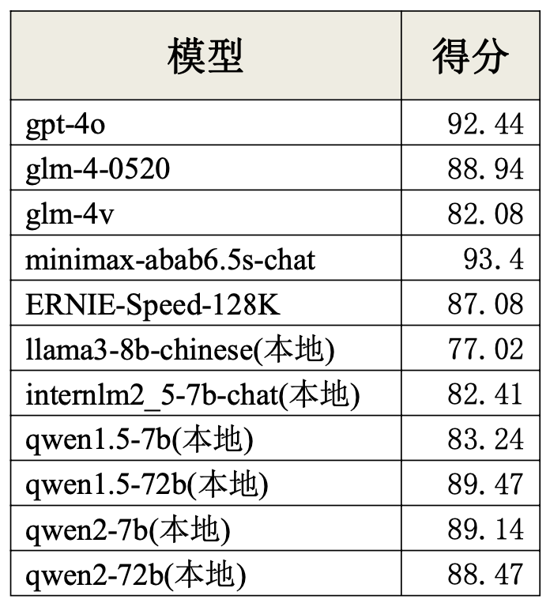
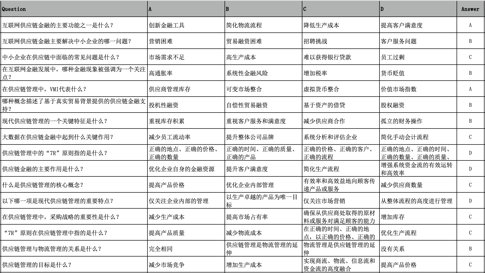
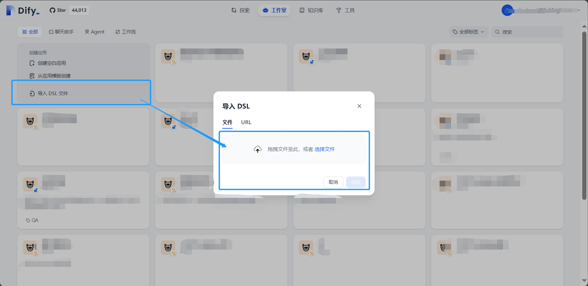
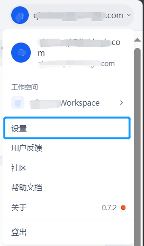
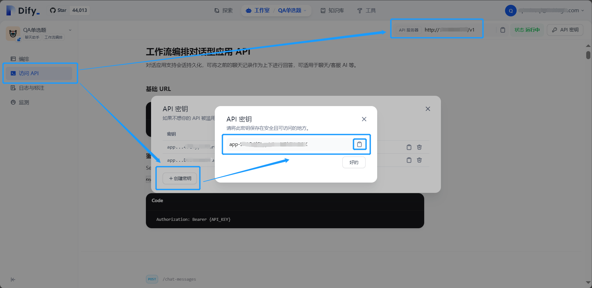

# Supply Chain Finance Large Model Evaluation Dataset

[简体中文](./README.md)|<b>English</b>

## Introduction

TThis project aims to automate the generation of industry-specific datasets, which can be used to evaluate the knowledge capabilities of large models in specific industry domains. For related research, please refer to the article: [《Establishing the Supply Chain Finance Large Model Evaluation System》](https://mp.weixin.qq.com/s?__biz=MzU0NjkxMzkwMQ==&mid=2247485540&idx=1&sn=eb8c79bedc1f50785bc55fce66c84068&chksm=fafdd5995128080f995e1f631e0f73344ae482dd7a8f5a370c9efac12947248ffac5cb305029&mpshare=1&scene=1&srcid=0822x2QD1f09JbtdGj9tYmjh&sharer_shareinfo=5ee13f993ca383ad4700be911123e393&sharer_shareinfo_first=1646c336ffd0b1259e9e605b0418717c#rd)

The project currently supports three types of questions: single-choice, true/false, and open-ended questions. By leveraging Dify workflows, the question generation process is automated. Python scripts are used to call APIs, enabling batch reading, generation, and formatted output of question materials. The supply chain finance dataset generated by this project has been used to evaluate the industry knowledge capabilities of large models on the OpenCompass platform.

The evaluation results for the knowledge capabilities of models in the supply chain finance domain are as follows:

<p align="center">
  
</p>

Dataset preview, including 2,959 multiple-choice questions, 975 true/false questions, and 1,161 short answer questions.：

<p align="center">
  
</p>


## Catalog

```bash

.
├── dataset                  # Generated datasets
│   ├── mcq.jsonl
│   ├── qa.jsonl
│   └── TorF.jsonl
├── docs                        # docs about this project
│   └── 数据集评测背景及过程.pdf
├── dify_file                # Dify workflow file
│   ├── check_mcq.yml
│   ├── check_TF.yml
│   ├── generate_mcq.yml
│   ├── generate_qa.yml
│   └── generate_TF.yml
├── QAgenerate               # Python project
│   ├── checkQA_mcq.py    # py files for check
│   ├── checkQA_TF.py
│   ├── txt2QA_qa.py # py files for QA generation via txt
│   ├── txt2QA_mcq.py
│   ├── txt2QA_TF.py
│   ├── url2QA_TF.py          # py files for QA generation via url
│   ├── url2QA_mcq.py
│   ├── url2QA_qa.py
│   ├── cutPdf.py             # other files（for pdf cutting,file format transfer）
│   ├── data2jsonl.py
│   ├── txt_list              # folder  for txt
│   └── dataset               # folder  for generated folders
├── README.md
├── README_EN.md
```


## Environment

### 1. Dify: version 0.6.14

To start Dify service you can choose to deploy Dify locally or use [Dify Cloud](https://dify.ai/). If you choose the way of running the docker-compose.yml file to start the service, please make sure  that [Docker](https://docs.docker.com/get-started/get-docker/) and [Docker Compose](https://docs.docker.com/compose/install/) are installed on your machine. For more details refer to [Dify](https://docs.dify.ai/)


### 2. Python : version 3.11

This project requires [Python](https://www.python.org/downloads/) environment for reading of material, API calls for dify workflows and formatted output of QA datasets. 


## Start

### 1. Dify workflow import

All the dify workflow in our project have been already explored out as DSL file, and they are in the folder named [dify_file](./dify_file/). Before start this project you are supposed to import all the dify workflow you need into your dify studio.

<p align="center">
  
</p>


### 2. LLM Block Settings

<p align="center">
  
  
</p>

When setting the model provider, you can get API key by following tips on the page and then use the model. The default  model in our dify wolkflow are minimax-6.5s and qwen1.5. And you can change any model provided in dify as you need. If necessary, just don't forget to change the model settings in LLM block of your workflow.


### 3. API Key Creat & Fill

#### (1)Creat
<p align="center">
  
</p>

Click “API Access” in the left navigation bar in the workflow editor page, and then click the "API key" in the upper-right corner to creat an API key, and don't forget to record the "API server address" in the upper-right corner while recording the API key you created.


#### (2)Fill

Fill in the blanks in the function that calls dify workflow in python files with the corresponding URL and API key.

```python

def get_llm_response(input_text):         
    url = 'your_dify_url'     #add your dify url
    data = {
    "inputs": {},
    "query": input_text,
    "response_mode": "blocking",
    "conversation_id": "",
    "user": "abc-123",
    }
    json_data = json.dumps(data)
    response = requests.post(url,
                             data=json_data,
                             headers={
                                 "Content-Type": "application/json",
                                 'Authorization': f'Bearer your_dify_workflow_apikey'  #add your workflow apikey 
                             }
                             )
    response_text = response.text
    
    return json.loads(response_text)['answer']
```


<b>Note the correspondence between the Dify workflow and the python file</b>

The Dify workflow for QA generation is distinguished only by the type of question, and each workflow for QA generation can generate the corresponding type of question whether input text or URL, but different materials for generation are input in different ways, thus corresponding to different python scripts respectively.


<table>
    <tr>
        <th> Dify file </th>
        <th> Python file </th>
        <th> Introduction</th>
    </tr>
    <tr>
        <td rowspan="2"><a href="./dify_file/generate_mcq.yml">generate_mcq.yml</a></td>
        <td><a href="./QAgenerate_py/txt2QA_mcq.py">txt2QA_mcq.py</a></td>
        <td>Generate mcq via txt</td>
    </tr>
    <tr>
        <td><a href="./QAgenerate_py/url2QA_mcq.py">url2QA_mcq.py</a></td>
        <td>Generate mcq via url</td>
    </tr>
    <tr>
        <td rowspan="2"><a href="./dify_file/generate_TF.yml">generate_TF.yml</a></td>
        <td><a href="./QAgenerate_py/txt2QA_TF.py">txt2QA_TF.py</a></td>
        <td>Generate TorF Question via txt</td>
    </tr>
    <tr>
        <td><a href="./QAgenerate_py/url2QA_TF.py">url2QA_TF.py</a></td>
        <td>Generate TorF Question via url</td>
    </tr>
    <tr>
        <td rowspan="2"><a href="./dify_file/generate_qa.yml">generate_qa.yml</a></td>
        <td><a href="./QAgenerate_py/txt2QA_qa.py">txt2QA_qa.py</a></td>
        <td>Generate qa via txt</td>
    </tr>
    <tr>
        <td><a href="./QAgenerate_py/url2QA_qa.py">url2QA_qa.py</a></td>
        <td>Generate qa via url</td>
    </tr>
</table>


### 4. Generation

#### 1）Input

Materials for QA generation supports both text ans url：


- If the material is of text type, it should be divided into several `.txt` files with appropriate content length and placed in a folder.

Due to current workflow input limitations and settings, it is recommended that each txt file be limited to between 1000 and 5000 words. You can also change the prompts in workflow about the number of questions based on the characteristics of your material.

- If the material is of url type, you are supposed to store all the urls in a table in a `.xlsx` file with the column name `url` . You can modify the prompts based on your material.


#### 2）Output

The output format will vary depending on the type of questions generated:

##### (1)mcq

| question | A | B | C | D | answer | file/url |
|  :---:  |  :---:  |  :---:  |  :---:  |  :---:  |  :---:  |  :---:   |

##### (2)TorF 

| question | answer | file/url | 
|  :---:  |  :---:  |  :---:  |

##### (3)qa

| question | answer | file/url | 
|  :---:  |  :---:  |  :---:  |


## 5.Check

When the quality of the text material for QA generatiob is unstable, particularly when questions are derived from URLs, 'information-based questions' tend to arise. These questions often rely on time-sensitive information or isolated data, which are not meaningful for assessing the model's knowledge  ability in a specific domain. Therefore, it is necessary to filter out such questions. When dealing with a large volume of questions, manual screening becomes impractical. A better solution is to use a LLM to check question dataset, removing incorrect questions and filtering out 'information-based questions.

The corresponding Dify workflow are [check_mcq.yml](./dify_file/check_mcq.yml) and [check_TF.yml](./dify_file/check_TF.yml)；the python screpts that import the above workflows are [checkQA_mcq.py](./QAgenerate_py/check_mcq.py) and [checkQA_TF.py](./QAgenerate_py/check_TF.py).The preparation before checking is the same as when generating, which requires importing the workflow, setting the model and creating the api key.

# Dataset

The data set generated so far includes more than 5000 questions(including mcq,qa and TorF). In order to evaluate LLMs the dataset have all been converted to `.jsonl` format and located in the folder [dataset](./dataset/) , the format conversion script of dataset refer to the project's [data2jsonl.py](./QAgenerate_py/data2jsonl.py).

# Model Evaluation

### Quick Evaluation

The model evaluation of the dataset generated by this project is based on [Opencompass](https://opencompass.org.cn/home), and the related configuration refer to [User Guides](https://opencompass.org.cn/doc). The python script for conversion of the corresponding dataset format `.jsonl` is described in the “Datasets” section.
It is easier to use customized dataset to select mcq, you can directly upload the mcq dataset to the specified path, and then start the evaluation. For qa type of dataset, you are supposed to customize the dataset by modifying the default assessment indicators.


### Notes:
#### 1. qa Evaluation
The default evaluation metric for the qa type of opencompass is the ACCEvaluator (the adapted Q&A  type is the one with a definite answer, e.g., “Question: 20+50=?Answer: 70”), while the Q&A  generated in this project are subjective, and the appropriate evaluation metric should be the EMEvaluator. If this indicator is not adjusted, the result of the Q&A evaluation score will be zero.

#### 2.TorF Question Evaluation
There two ways to evaluate the TorF question:

##### （1）Use the format of qa evaluation  and add prompts

Upload [TorF.jsonl](./dataset/TorF.jsonl) to the specified path, add the following content in the configuration file to use the qa format for evaluation while specifying the dataset and add prompt  to limit the output of responses from models:

```text
 {"path": "/your_dataset_path/panduan.jsonl", "data_type": "qa", "infer_method": "gen", "human_prompt":"问题:{question}\n请回复该问题，要求只能回答Y或者N，正确请回复:Y,错误请回复N"}
```

##### （2）Use the format of mcq evaluation and change the datasets fields

Convert TorF questions to mcq, and the rest of the process is the same as for mcq evaluation:

Example：
` answer：T `    TO      `A：T, B：F, C：not sure, answer：A`

For this project, we chose to convert the TorF questions to mcq question format for evaluation, and the format of the dataset in the [TorF.jsonl](./dataset/TorF.jsonl)  in the folder [datasest](./dataset/) has been converted according to the example above.

```text
{"question": "虚拟经济中，交易的便利性是商业繁荣的必要条件。这句话是", "A": "正确的", "B": "错误的", "C": "不确定", "answer": "A"}
{"question": "区块链技术的进步使得主体在价值创造过程中，拥有分享更多利益的博弈手段。这句话是", "A": "正确的", "B": "错误的", "C": "不确定", "answer": "A"},
{"question": "区块链技术的出现将完全消除交易中的信用问题。这句话是", "A": "正确的", "B": "错误的", "C": "不确定", "answer": "B"}
```
